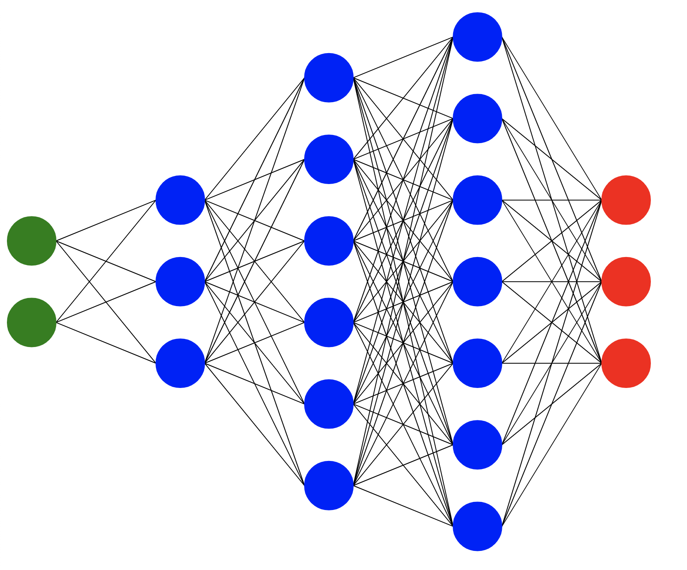

# Neuradraw

A plain and simple way to draw fully connected neural networks.

## Summary

Neuradraw came from the desire to be able to draw complex neural network architectures with a variety of different colors and annotations. The project's conception is based here in the `neuradraw` repository but continues in 3 different flavors and versions. Those flavors and versions are:

[`Neuradraw-2`](https://github.com/Bryce-Davidson/neuradraw-2), [`Neuradraw-ts`](https://github.com/Bryce-Davidson/neuradraw-ts) & [`Neuradraw-node`](https://github.com/Bryce-Davidson/neuradraw-node)

The reasons for moving on to developing on a different code base and paradigm are included below in the discontinued section.

# Discontinued Reasons

Decided that p5.js wasn't enough out of the box functionality for the project's use case. Have decided to build my version of p5.js and incorporate webpack to allow access to npm in the neuradraw-2 repository. This project is continued there.

# Installation

To install Neuradraw run:
`git clone https://github.com/Bryce-Davidson/neuradraw`

You will need some basic knoledge of the `p5.js` drawing paradigm and can find that info here.

[Basics of p5.js Drawing](https://www.youtube.com/watch?v=D1ELEeIs0j8)


## Example



--- 
`sketch.js`

```javascript
var nn = new DNN("DNN_1");

nn.add_layer(2, "green", "input")
nn.add_layer(3, "blue", "h_1")
nn.add_layer(6, "blue", "h_2")
nn.add_layer(7, "blue", "h_3")
nn.add_layer(3, "red", "output")

function setup() {
    createCanvas(2000, 2000);
    frameRate(30);
    noLoop();
}

function draw() {
    // Stands as an easy example
    clear();
    nn.draw({
        diameter: 60,
        node_spacing: 60 + 60*Math.sin(frameCount/100),
        layer_spacing: 120 + Math.abs(300*Math.sin(frameCount/100)),
        weight_thicknesses: 1
    });
}
```
# Viewing the sketch

Open the `index.html` file from a file browser.

*Or* 


You will need [Nodejs](https://nodejs.org/en/) Installed on your machine for the `npx` commands listed below to work. Or you can simply open the `index.html` file after creating your DNN in `sketch.js`

To show the drawing, run: `npx http-server ./` and open a browser to `localhost:8080`.

*Or*

`open http://localhost:8080 &&  npx http-server ./`.


# DNN Drawing Options

From `DNN.js`


{ *Number* } ~ **x** - The x position of the DNN.

{ *Number* } ~ **y** - The y position of the DNN.

{ *Number* } ~ **diameter** - The diameter of the nodes of the DNN.

{ *Number* } ~ **layer_spacing** - The spacing between each layer.

{ *Number* } ~ **node_spacing** - The spacing between each node in 
the layers.

{ *[ String|Number ] | String | Number* } ~ **weight_colors** - The spacing between each node in the layers.

{ *[Number] | Number* } ~ **weight_thicknesses** - The spacing between each node in the layers.


```javascript
// ----- Inside sketch.js -----

var nn = new DNN("name_of_dnn")

function setup() {
    createCanvas(2000, 2000);
    frameRate(30);
    noLoop();
}

function draw() {
    clear();
    // DNN Options
    nn.draw({
        x,
        y,
        diameter,
        layer_spacing,
        node_spacing,
        weight_colors,
        weight_thicknesses
    });
}

```